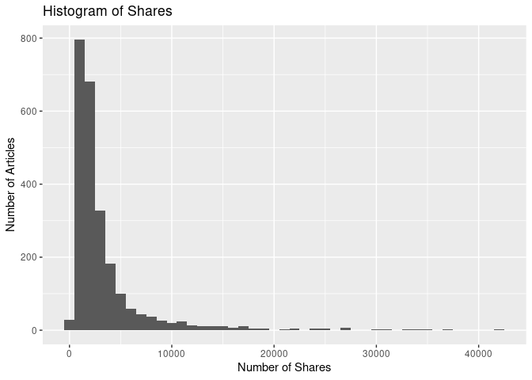
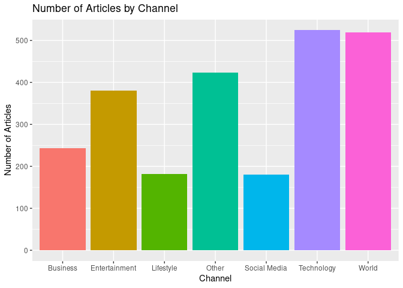
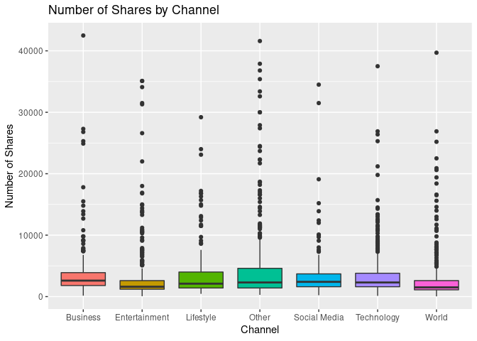
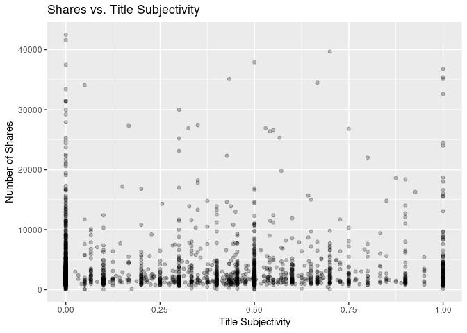
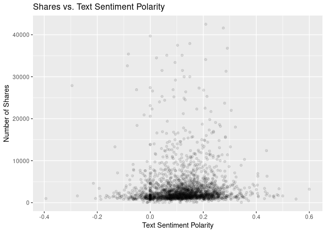
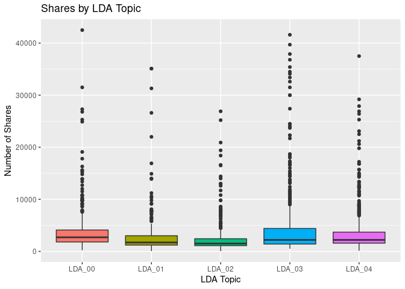

Project 2
================
Avy Harvey
6/27/2020

  - [Introduction](#introduction)
  - [Data](#data)
  - [Summarizations](#summarizations)
      - [Shares](#shares)
      - [Channel/Topic](#channeltopic)
      - [Sentiment](#sentiment)
      - [LDA](#lda)
  - [Modeling](#modeling)
      - [Random Forest](#random-forest)
      - [Logistic Regression](#logistic-regression)
      - [Model Comparison](#model-comparison)
  - [Automation](#automation)

## Introduction

The purpose of this project is to build models to predict the number of
social media shares that an online news article will receive.
Specifically, I will train several logistic regression models and random
forest models, use repeated 10-fold cross-validation to select a single
candidate model for each type of algorithm, then compare those candidate
models on the holdout test data set. This process will be repeated for
every day of the week on which an article can be published (i.e.,
Monday, Tuesday, Wednesday, Thursday, Friday, Saturday, Sunday).

This particular report focuses on the data filtered for
**`weekday_is_saturday`**.

The data used in this project is the [Online News
Popularity](https://archive.ics.uci.edu/ml/datasets/Online+News+Popularity)
data set available from the UCI Machine Learning Repository. All of the
news articles in referenced in this data set were published by
[Mashable](https://www.mashable.com), and can be referenced using the
`url` variable. The data dictionary is available on the UCI website for
the data set linked above.

## Data

The data set contains 58 predictor variables and one target variable
(`shares`). The predictor variables are either numeric or binary and
represent various statistics associated with the news articles.

As mentioned before, I will be creating a different model for each day
of the week, as denoted by the `weekday_is_*` indicator variables.
Therefore, these variables (along with `is_weekend`) will not be
included in my model-building process.

The other predictor variables attempt to measure a number of things.
Some metadata about the article is available, such as number of links,
images, and videos. Additionally, the channel (or segment) that the
article falls under is also available as a set of indicator variables.
These include channels such as lifestyle, entertainment, and technology.

Most of the remaining predictor variables are derived using natural
language processing techniques. These include variables that tokenize
the text and provide counts, such as number of tokens in the title,
article content, stop words, and unique tokens. There is another set of
indicator variables that is created from a form of unsupervised
clustering in natural language processing, called Latent Dirichlet
allocation (LDA). There are also variables related to article sentiment
and polarity. These variables describe the overall feeling that an
article’s text provides, as well as describing how polarizing the
language in the title is.

First, I’ll read in the data, filter it for the weekday for which I will
build a model (weekday\_is\_saturday), and remove the columns that I
won’t be using:

``` r
df <- read_csv("data/OnlineNewsPopularity.csv") %>%
  filter(!!sym(params$day) == 1) %>%  # !!sym() evaluates the provided column for dplyr
  select(-starts_with("weekday_is_"), -is_weekend, -url, -timedelta)
```

    ## Parsed with column specification:
    ## cols(
    ##   .default = col_double(),
    ##   url = col_character()
    ## )

    ## See spec(...) for full column specifications.

## Summarizations

For news articles to be shared on social media, I hypothesize that the
reader must have been interested in it in some way. There are several
reasons why a person might find an article interesting.

### Shares

**Q: What does the distribution of the `shares` variable look like?**

First, I’ll calculate a numeric summary of `shares`, which should give
me an idea of how spread out the data is (including outliers):

``` r
summary(df$shares)
```

    ##    Min. 1st Qu.  Median    Mean 3rd Qu.    Max. 
    ##      43    1300    2000    4078    3600  617900

``` r
# Standard deviation
sd(df$shares)
```

    ## [1] 14230.53

In this graph, I expect the distribution to be right-skewed due to viral
news articles that get an extremely high number of shares. To keep the
distribution visible, I filter out the outliers before plotting.

``` r
df %>%
  filter(shares < 3 * sd(shares)) %>%
  ggplot(aes(x = shares)) +
  geom_histogram(binwidth = 1000) +
  labs(title = "Histogram of Shares", x = "Number of Shares", y = "Number of Articles")
```

<!-- -->

### Channel/Topic

**Q: How many articles are published in a given channel or topic, and
how many shares do they get?**

This graph displays the number of articles that were published under a
particular topic. I noticed that there are several articles that don’t
match one of the indicator variables, so I created another category
called “Other”.

``` r
df %>%
  select(starts_with("data_channel_is_")) %>%
  rename(Lifestyle = data_channel_is_lifestyle,
         Entertainment = data_channel_is_entertainment,
         Business = data_channel_is_bus,
         `Social Media` = data_channel_is_socmed,
         Technology = data_channel_is_tech,
         World = data_channel_is_world) %>%
  mutate(Other = !(Lifestyle | Entertainment | Business | `Social Media` | Technology | World)) %>%
  pivot_longer(everything(), names_to="Channel") %>%
  filter(value == 1) %>%
  ggplot(aes(x = Channel, group = Channel)) +
  geom_bar(aes(fill = Channel), show.legend = FALSE) +
  labs(title = "Number of Articles by Channel", y = "Number of Articles")
```

<!-- -->

Next, I want to explore the distribution of shares for each of those
channels. This can help me understand which channels may be associated
with a higher number of shares. I’ll exclude outliers in this graph so
that the boxes are visible.

``` r
df %>%
  select(starts_with("data_channel_is_"), shares) %>%
  rename(Lifestyle = data_channel_is_lifestyle,
         Entertainment = data_channel_is_entertainment,
         Business = data_channel_is_bus,
         `Social Media` = data_channel_is_socmed,
         Technology = data_channel_is_tech,
         World = data_channel_is_world) %>%
  mutate(Other = !(Lifestyle | Entertainment | Business | `Social Media` | Technology | World)) %>%
  pivot_longer(-shares, names_to="Channel") %>%
  filter(value == 1 & shares < 3 * sd(df$shares)) %>%  # Exclude outliers
  ggplot(aes(x = Channel, y = shares)) +
  geom_boxplot(aes(fill = Channel), show.legend = FALSE) +
  labs(title = "Number of Shares by Channel", y = "Number of Shares")
```

<!-- -->

### Sentiment

**Q: How does title subjectivity affect number of shares?**

A title’s subjectivity tries to measure much a title sounds like an
opinion versus being factual. I hypothesize that titles that sound
factual and confident are more likely to grab a readers attention than
an opinionated title.

First, let’s look at a quick summary of the variable before visualizing
a comparison:

``` r
summary(df$title_subjectivity)
```

    ##    Min. 1st Qu.  Median    Mean 3rd Qu.    Max. 
    ##  0.0000  0.0000  0.2000  0.2921  0.5000  1.0000

``` r
df %>%
  filter(shares < 3 * sd(shares)) %>%  # Exclude outliers
  ggplot(aes(x = title_subjectivity, y = shares)) +
  geom_point(alpha = 0.25) +
  labs(title = "Shares vs. Title Subjectivity", x = "Title Subjectivity", y = "Number of Shares")
```

<!-- -->

**Q: How does text sentiment polarity affect number of shares?**

Polarity tries to measure how negative or positive a document sounds. I
suspect the extremes may affect how likely a person is to share a news
article.

Again, we’ll first look at a numeric summary before visualizing a
comparison:

``` r
summary(df$global_sentiment_polarity)
```

    ##     Min.  1st Qu.   Median     Mean  3rd Qu.     Max. 
    ## -0.39375  0.06259  0.12519  0.12482  0.18932  0.60000

``` r
df %>%
  filter(shares < 3 * sd(shares)) %>%  # Exclude outliers
  ggplot(aes(x = global_sentiment_polarity, y = shares)) +
  geom_point(alpha = 0.1) +
  labs(title = "Shares vs. Text Sentiment Polarity", x = "Text Sentiment Polarity", y = "Number of Shares")
```

<!-- -->

### LDA

**Q: How does LDA closeness affect number of shares?**

LDA closeness measures how close a document is to an unlabeled topic.
This can be thought of as closeness to a centroid in k-means clustering,
but for natural language processing. I want to see if particular LDA
topics affect how often an article is shared.

``` r
df %>%
  filter(shares < 3 * sd(shares)) %>%  # Exclude outliers
  mutate(n = row_number()) %>%
  pivot_longer(starts_with("LDA"), names_to = "LDA") %>%
  group_by(n) %>%
  # Code referenced from https://stackoverflow.com/a/29657877
  slice(which.max(value)) %>%  # Don't drop other columns, but log max LDA
  ggplot(aes(x = LDA, y = shares)) +
  geom_boxplot(aes(fill = LDA), show.legend = FALSE) +
  labs(title = "Shares by LDA Topic", x = "LDA Topic", y = "Number of Shares")
```

<!-- -->

## Modeling

I’m going to turn this problem into a binary classification problem by
splitting the `shares` variable into two groups:  and .

``` r
df_bin <- df %>%
  mutate(sharesBin = as_factor(ifelse(shares < 1400, 0, 1))) %>%
  select(-shares)
```

Before I start training my models, I’ll split the data into a train and
test set using random sampling:

``` r
# Set seed for reproducibility
set.seed(1)

# Sample training indices
train_index <- createDataPartition(df_bin$sharesBin, p = .7)[[1]]

# Create train and test sets
df_train <- df_bin[train_index,]
df_test <- df_bin[-train_index,]
```

### Random Forest

The ensemble model that I will try is a random forest. I will preprocess
the predictor variables with centering and scaling. I will use repeated
10-fold cross validation to select the best value of `mtry` (the
parameter which controls how many predictors are randomly sampled at
each split), among several distinct values of `mtry`. That model will be
the selected candidate model for Random Forest.

``` r
# Process training in parallel
# Referenced caret vignette at https://topepo.github.io/caret/parallel-processing.html
cl <- makePSOCKcluster(8)
registerDoParallel(cl)

# Set seed for reproducibility
set.seed(1)

# Do repeated cross validation 3 times
train_control <- trainControl(method = "repeatedcv", number = 10, repeats = 3)

# Build the random forest model using 10 different values of mtry
random_forest_fit <- train(sharesBin ~ ., data = df_train, method = "rf",
 trControl=train_control,
 preProcess = c("center", "scale"),
 tuneGrid = expand.grid(.mtry = c(2:8, 15, 30, 45)))

# Turn off the cluster for parallel processing
stopCluster(cl)

# Show the results
random_forest_fit
```

    ## Random Forest 
    ## 
    ## 1718 samples
    ##   50 predictor
    ##    2 classes: '0', '1' 
    ## 
    ## Pre-processing: centered (50), scaled (50) 
    ## Resampling: Cross-Validated (10 fold, repeated 3 times) 
    ## Summary of sample sizes: 1547, 1546, 1546, 1546, 1546, 1546, ... 
    ## Resampling results across tuning parameters:
    ## 
    ##   mtry  Accuracy   Kappa    
    ##    2    0.7714368  0.2096615
    ##    3    0.7708532  0.2135589
    ##    4    0.7710481  0.2242683
    ##    5    0.7706594  0.2231980
    ##    6    0.7704644  0.2217360
    ##    7    0.7689072  0.2198415
    ##    8    0.7710458  0.2285135
    ##   15    0.7708464  0.2330819
    ##   30    0.7681309  0.2326984
    ##   45    0.7692971  0.2389384
    ## 
    ## Accuracy was used to select the optimal model using the largest value.
    ## The final value used for the model was mtry = 2.

### Logistic Regression

The linear model that I will try is logistic regression since the target
is binary. I will preprocess the predictor variables with centering and
scaling. I’ll also be using Lasso regularization during training by
fixing the `alpha` parameter at 1 ([source
link](https://web.stanford.edu/~hastie/glmnet/glmnet_alpha.html)). Lasso
regularization penalizes model complexity by setting the parameter
estimates for unimportant variables to zero, effectively acting as a
form of feature selection. I will use repeated 10-fold cross validation
to select the best value of `lambda` (the regularization parameter).
That model will be the selected candidate model for Logistic Regression.

``` r
# Process training in parallel
# Referenced caret vignette at https://topepo.github.io/caret/parallel-processing.html
cl <- makePSOCKcluster(8)
registerDoParallel(cl)

# Set seed for reproducibility
set.seed(1)

# Do repeated cross validation 3 times
train_control <- trainControl(method = "repeatedcv", number = 10, repeats = 3)

# Build the LASSO logistic regression models with different values for lambda
log_reg_fit <- train(sharesBin ~ ., data = df_train, method = "glmnet", family = "binomial",
 trControl=train_control,
 preProcess = c("center", "scale"),
 tuneGrid = expand.grid(.alpha = 1, .lambda = 10^(seq(-5,0, by=0.25))))

# Turn off the cluster for parallel processing
stopCluster(cl)

# Show the results
log_reg_fit
```

    ## glmnet 
    ## 
    ## 1718 samples
    ##   50 predictor
    ##    2 classes: '0', '1' 
    ## 
    ## Pre-processing: centered (50), scaled (50) 
    ## Resampling: Cross-Validated (10 fold, repeated 3 times) 
    ## Summary of sample sizes: 1547, 1546, 1546, 1546, 1546, 1546, ... 
    ## Resampling results across tuning parameters:
    ## 
    ##   lambda        Accuracy   Kappa       
    ##   1.000000e-05  0.7489290   0.199682343
    ##   1.778279e-05  0.7489290   0.199682343
    ##   3.162278e-05  0.7489290   0.199682343
    ##   5.623413e-05  0.7489290   0.199682343
    ##   1.000000e-04  0.7489290   0.199682343
    ##   1.778279e-04  0.7487352   0.198906573
    ##   3.162278e-04  0.7485380   0.197288368
    ##   5.623413e-04  0.7487284   0.194284155
    ##   1.000000e-03  0.7493121   0.190284432
    ##   1.778279e-03  0.7483385   0.178267256
    ##   3.162278e-03  0.7495047   0.163684083
    ##   5.623413e-03  0.7543588   0.152679566
    ##   1.000000e-02  0.7541593   0.115922925
    ##   1.778279e-02  0.7440829   0.016119279
    ##   3.162278e-02  0.7442790  -0.001529176
    ##   5.623413e-02  0.7450564   0.000000000
    ##   1.000000e-01  0.7450564   0.000000000
    ##   1.778279e-01  0.7450564   0.000000000
    ##   3.162278e-01  0.7450564   0.000000000
    ##   5.623413e-01  0.7450564   0.000000000
    ##   1.000000e+00  0.7450564   0.000000000
    ## 
    ## Tuning parameter 'alpha' was held constant at a value of 1
    ## Accuracy was used to select the optimal model using the largest value.
    ## The final values used for the model were alpha = 1 and lambda = 0.005623413.

### Model Comparison

Now that we have trained a GLM and a non-linear model, let’s compare
their accuracy on the holdout test data set.

``` r
get_test_accuracy <- function(model) {
  # Create confusion matrix from predictions
  confusion_matrix <- predict(model, newdata = df_test) %>%
    table(df_test$sharesBin)
  
  # Return accuracy rate
  sum(diag(confusion_matrix))/sum(confusion_matrix)
}

list("Random Forest" = random_forest_fit, "Logistic Regression" = log_reg_fit) %>%
  sapply(get_test_accuracy) %>%
  knitr::kable(caption = "Model Accuracy on Test Set", col.names = "Accuracy")
```

|                     |  Accuracy |
| ------------------- | --------: |
| Random Forest       | 0.7496599 |
| Logistic Regression | 0.7564626 |

Model Accuracy on Test Set

## Automation

This code was used to create reports for all of the `weekday_is_*`
variables. It can be executed in R to recreate the reports.

``` r
# Code referenced from class notes
weekday_vars = list("weekday_is_monday", "weekday_is_tuesday", "weekday_is_wednesday",
                  "weekday_is_thursday", "weekday_is_friday", "weekday_is_saturday",
                  "weekday_is_sunday")

# Create output file names and parameter lists
output_file <- paste0(weekday_vars, ".md")
params = lapply(weekday_vars, FUN = function(x){list(day = x)})

# Create tibble of reports to create
reports <- tibble(output_file, params)

# Create reports
pwalk(reports, rmarkdown::render,
      input = "arharvey_project2.Rmd",
      output_format = rmarkdown::github_document(toc = TRUE, pandoc_args = "--webtex"))
```
